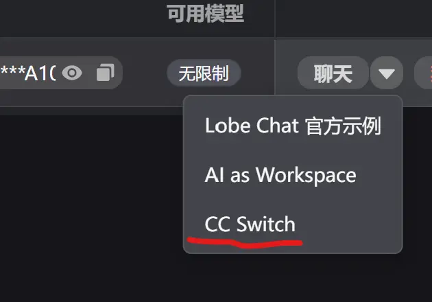
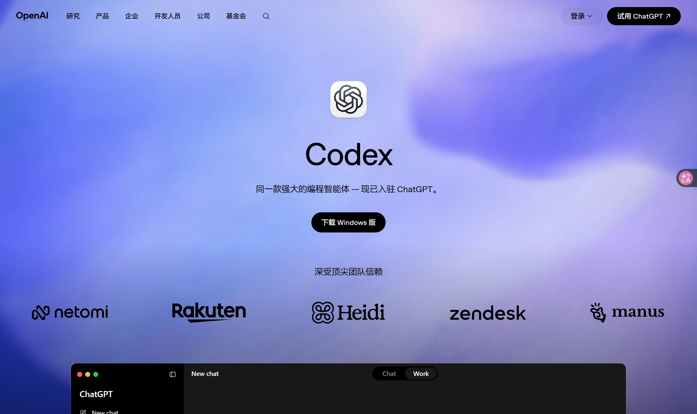
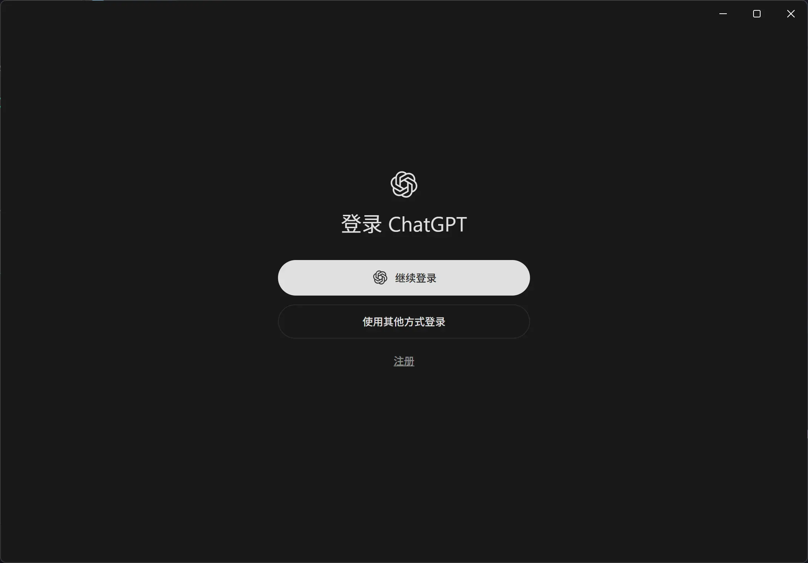
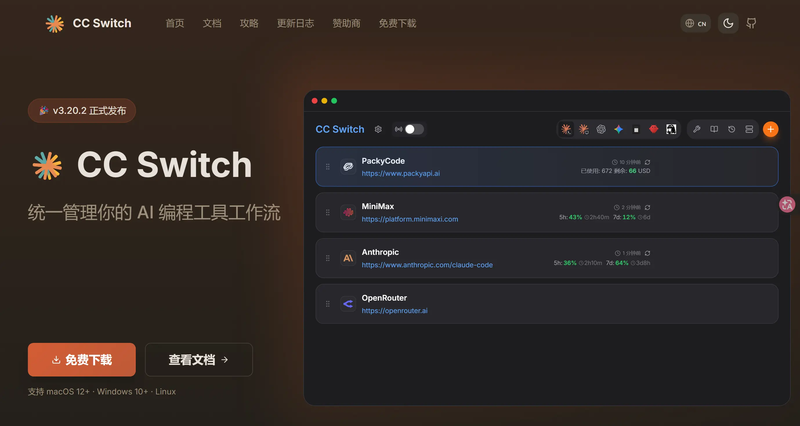
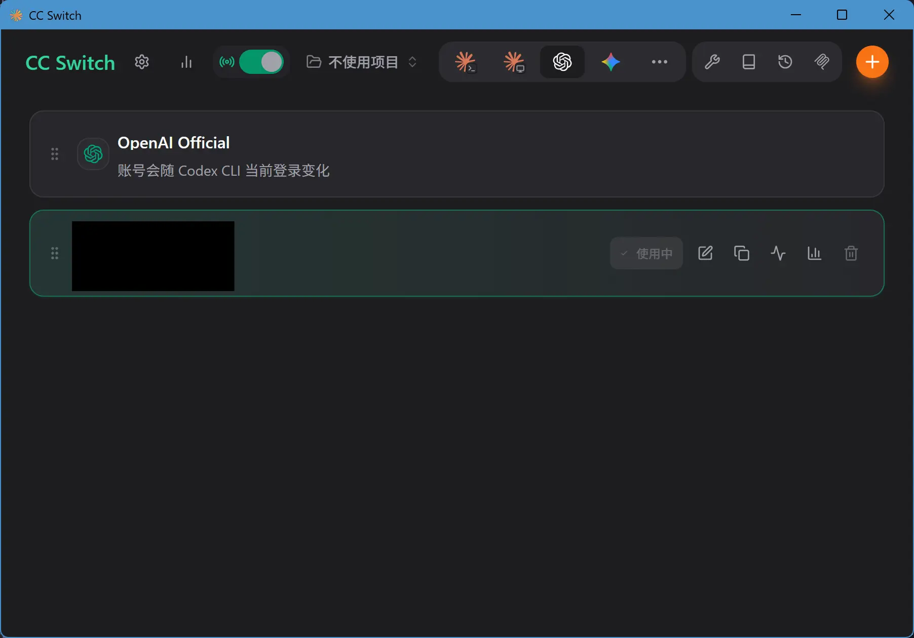
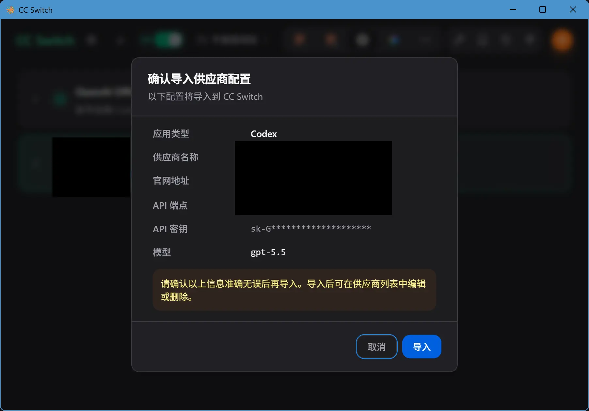
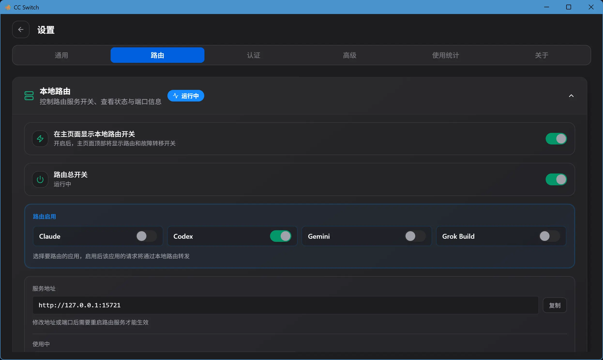
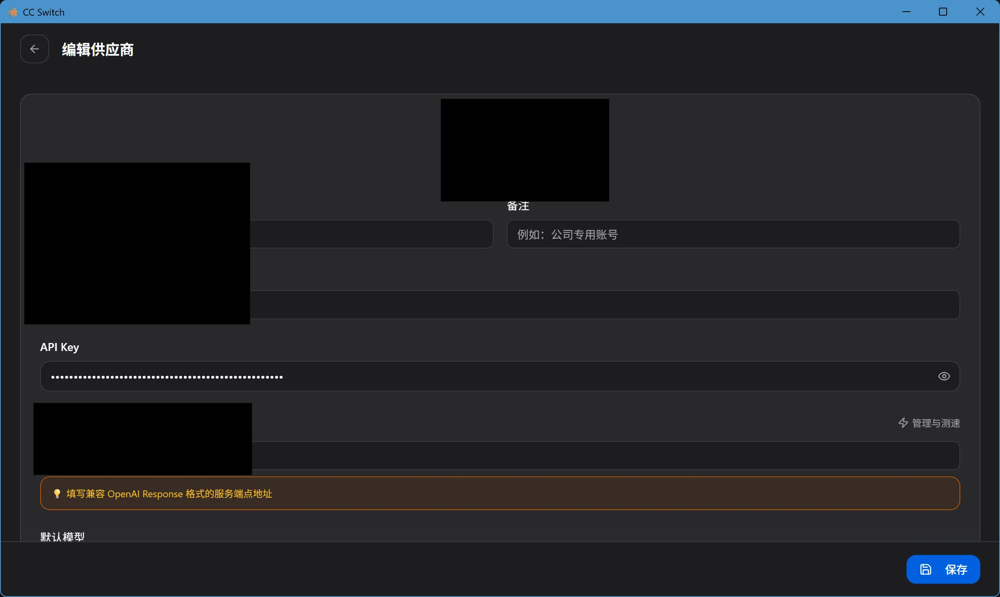
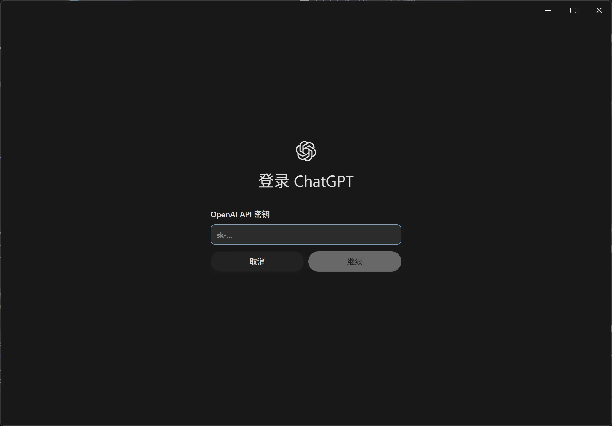
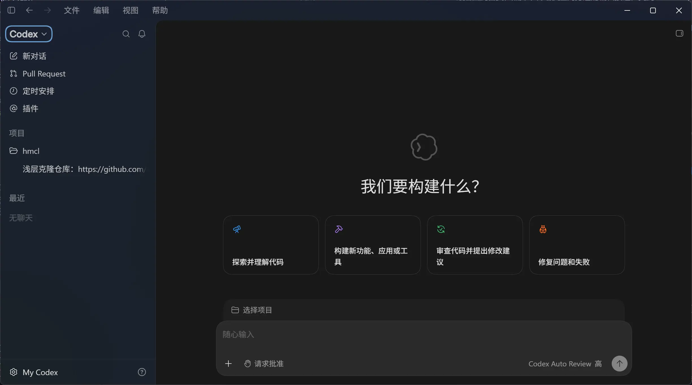

## 前言

最近几个月，也是用上了 CLI Agent 工具，比如 OpenCode，也使用了 Deepseek 很久了，但好奇心所驱，我想体验一下当今最顶尖模型的输出是什么样子的，于是我安装了 `Codex`，不过过程中有不少值得做个笔记写出来。

## 前置工作

:::tip 提醒
由于我是有一点点小魔法的，能进入 `OpenAI` 的官网下载他们 `Codex` 的最新版 `ChatGPT`。

所以你就得在网上搞到：

- `ChatGPT` 官方安装包
- `CC Switch` 安装包
- 一个最好支持 `CC Switch` 的 AI 中转站

:::

### 准备 AI 中转站

AI 中转站平台众多，质量参差不齐，所以我也没什么推荐的。

只要中转站后台**创建密钥后有 `CC Switch` 快捷入口就可以**（没有则需要手动填写）：

## ChatGPT 下载

进入 [ChatGPT 官网](https://openai.com/zh-Hans-CN/codex/)：

点击中间的下载按钮即可。

打开并安装之后看到这个窗口你就成功了：

此时**不要尝试直接使用 ChatGPT 登录**（当然你有国外手机号的话便可以），接下来我们将会使用 `CC Switch` 来代理接管 ChatGPT 的登录态。

## CC Switch 配置

进入 [CC Switch 官网](https://www.ccswitch.io/zh/)：

安装完后进入 `CC Switch` 的主界面：

**点击中转站留下的 `CC Switch` 一键导入按钮**，跳转到 `CC Switch`：

之后**点开左上角的设置，切换路由标签页，将本地路由打开**：

最后回到首页，点开中转站供应商旁边的编辑按钮，找到 `API Key` 一栏，复制：

### 导入 API Key 到 ChatGPT

回到 `ChatGPT`，点击“使用其他方式登录”，填入 API 密钥登录即可：

## 完成

当进入这个页面后说明 ChatGPT 登录成功了：

:::info 试试看吧？
在输入框测试一条消息，看看 AI 会不会回复你吧！

:::
